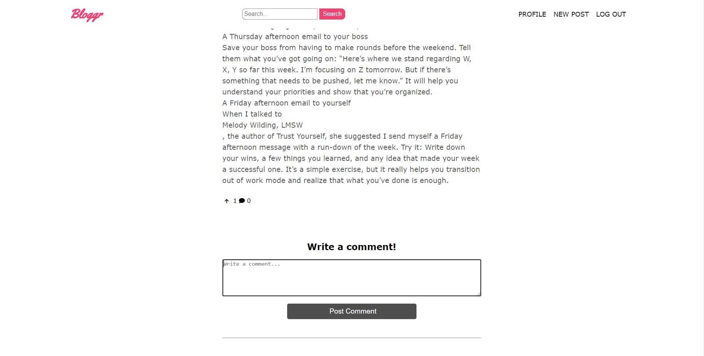

## Bloggr

<a href="http://bloggr.infinityfreeapp.com/Bloggr/" target="_blank">Zur Website</a>

Bloggr ist eine Seite auf der man eigene Blogartikel schreiben und veröffentlichen kann, sowie Blogartikel von anderen Usern lesen kann.

Das Frontend wurde mit HTML, SCSS und JavaScript erstellt und im Backend habe ich PHP und MySQL benutzt.
